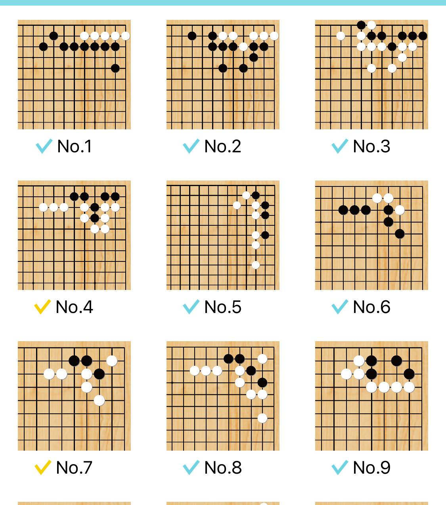
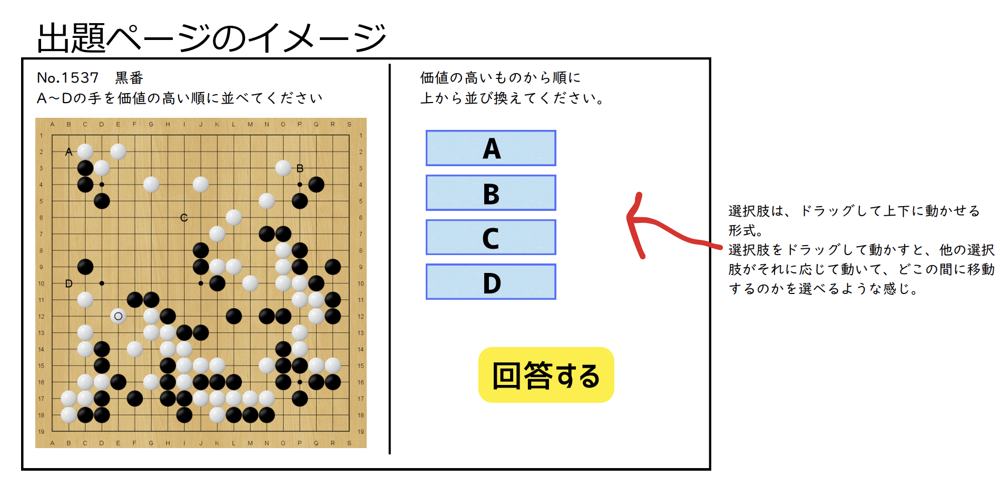
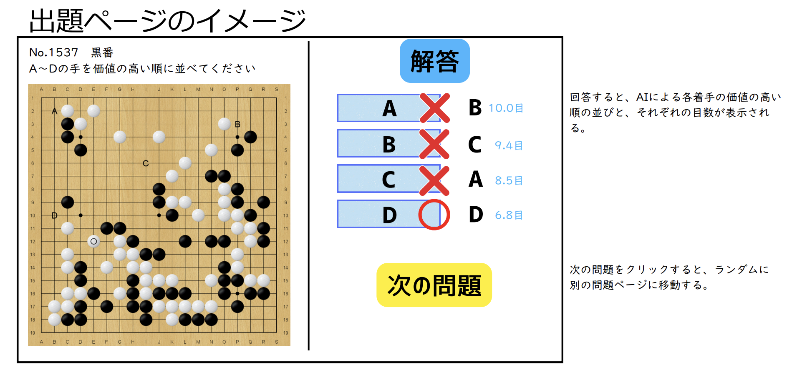

# よせもん（YOSEMON）仕様書

## 1. 基本コンセプト

### 1.1 サービス概要
- **サービス名**: よせもん（開発コード：ひと目のヨセ）
- **目的**: 大ヨセや小ヨセなどの大きな手が感覚的に選べるようになるための訓練をする『直感的なヨセ問題』出題サイト
- **特徴**: 
  - いごもんの既存ログイン制を利用
  - 囲碁AIを最大活用して、効率的に価値の高いヨセに目が行くようにする
  - 「いごもん」が『人間の着手の理由』を重視したのに対し、「よせもん」は囲碁AIを活用する

### 1.2 基本機能
- ある囲碁の局面において、複数（2〜4個）の着手の選択肢を提示
- ユーザーは選択肢を価値の高い順に並べて回答
- 各選択肢の囲碁AIにおける着手の価値（目数）が解答として表示
- 「次の問題」ボタンでランダムな別の問題を表示

## 2. 機能要件

### 2.1 よせもんトップページ (/yosemon)

#### 概要
- URL: https://igomon.net/yosemon
- 作成された問題の一覧を表示

#### 表示仕様
- 問題は追加日時の古い順（昇順）で表示
- 各問題の表示項目：
  - 盤面サムネイル
  - 問題番号
  - 回答状態：
    - 正解した問題：青丸（●）を問題番号の横に表示
    - 不正解：×を表示
    - 未回答：何も表示しない

#### 機能
- 問題をクリックすると該当の出題ページへ遷移
- ページネーション機能は不要

### 2.2 出題ページ (/yosemon/problems/{problem_id})

#### 概要
- 各問題ごとに一意のURLを持つ
- SGFファイルから読み込んだ問題の盤面を表示

#### 表示仕様
- 盤面：19路盤固定
- 手数：selection.jsonのmovesパラメータで指定された手数まで表示（指定がない場合は最終手まで）
- 選択肢：盤面上の指定座標にA, B, C, D...とアルファベット順に表示（2〜4個の可変）

#### 操作仕様
- ドラッグ&ドロップで選択肢を並び替え（モバイル対応必須）
- 回答ボタンをクリック：
  - 未ログイン：ログインページへ遷移
  - ログイン済み：解答ページへ遷移

### 2.3 解答ページ (/yosemon/problems/answers/{problem_id})

#### 表示仕様
- 回答結果：
  - 正解：「◯」を表示
  - 不正解：「×」を表示
- 正解情報：
  - 正解のアルファベット順序
  - 各選択肢の目数

#### 機能
- 「次の問題」ボタン：ランダムに別の問題を選択して出題ページへ遷移
- 「トップページへ」リンク：よせもんトップページへ遷移
- 「前の問題に戻る」機能は不要

## 3. 非機能要件

### 3.1 データ永続化
- SQLiteデータベースを使用
- ユーザーの回答結果を保存

### 3.2 認証
- いごもんの既存ログイン機能を使用

### 3.3 エラーハンドリング
- 不正な問題データ：問題として登録しない
- 存在しない問題ID：エラーページを表示

## 4. コンテンツ管理

### 4.1 問題の配置

#### ディレクトリ構造
```
igomon/
└── public/
    └── yosemon/
        └── problems/
            ├── 1/
            │   ├── kifu.sgf      # 盤面データ
            │   └── selection.json # 問題情報
            ├── 2/
            │   ├── kifu.sgf
            │   └── selection.json
            └── 3/
                ├── kifu.sgf
                └── selection.json
```

#### 問題番号
- ディレクトリ名（1, 2, 3...）を問題番号として使用

### 4.2 selection.json フォーマット

```json
{
  "moves": 30,
  "answers": [
    {"coordinate": "L11", "point": 11},
    {"coordinate": "G5", "point": 3},
    {"coordinate": "J8", "point": 8}
  ]
}
```

#### パラメータ説明
- **moves** (任意): 表示する手数。指定がない場合は最終手まで表示
- **answers** (必須): 選択肢の配列（2〜4個）
  - **coordinate**: 盤面上の座標（例: "L11"）
  - **point**: その手の価値（目数）
  - 配列の順序が正解順序（インデックス0が最も価値が高い）

### 4.3 座標の検証
- 指定された座標が19路盤上の有効な位置であることを検証

## 5. UIイメージ

### 5.1 よせもんトップページ


### 5.2 出題ページ


### 5.3 解答ページ


## 6. データベース設計

### 6.1 テーブル構造

#### YosemonProblem（よせもん問題テーブル）
| カラム名 | 型 | 制約 | 説明 |
|---------|-----|------|------|
| id | INT | PK, AUTO_INCREMENT | 主キー |
| problem_number | INT | UNIQUE | 問題番号（ディレクトリ名） |
| moves | INT | NULL可 | 表示する手数 |
| created_at | DATETIME | DEFAULT NOW | 作成日時 |
| updated_at | DATETIME | ON UPDATE | 更新日時 |

#### YosemonAnswer（正解選択肢テーブル）
| カラム名 | 型 | 制約 | 説明 |
|---------|-----|------|------|
| id | INT | PK, AUTO_INCREMENT | 主キー |
| problem_id | INT | FK, INDEX | 問題ID |
| coordinate | VARCHAR | NOT NULL | 座標（例: "L11"） |
| point | INT | NOT NULL | 目数 |
| order_index | INT | NOT NULL | 正解順序（0が最高価値） |

#### YosemonUserAnswer（ユーザー回答テーブル）
| カラム名 | 型 | 制約 | 説明 |
|---------|-----|------|------|
| id | INT | PK, AUTO_INCREMENT | 主キー |
| problem_id | INT | FK, INDEX | 問題ID |
| user_id | INT | FK, INDEX | ユーザーID |
| user_answer | VARCHAR | NOT NULL | 回答順序（例: "A,C,B,D"） |
| is_correct | BOOLEAN | NOT NULL | 正解/不正解 |
| created_at | DATETIME | DEFAULT NOW | 回答日時 |

### 6.2 主な機能
- **複数回回答**: 同じユーザーが同じ問題に複数回回答可能
- **正解率計算**: YosemonUserAnswerテーブルから問題ごとの正解率を集計可能
- **最新回答取得**: created_atでソートして最新の回答状態を取得

## 7. 技術仕様

### 7.1 使用技術
- **フレームワーク**: 既存のいごもんと同じ技術スタック
- **SGFパーサー**: いごもんの既存パーサーを流用
- **盤面表示**: 既存コンポーネントを流用または新規作成
- **認証**: いごもんの既存ログイン機能を使用

### 7.2 管理方法
- 問題の追加・更新・削除：ファイルシステムで直接管理（管理画面は不要）
- 難易度設定：不要
- 回答時間の記録：不要

## 8. UI/UX仕様

### 8.1 レスポンシブ対応
- デスクトップ・モバイル両対応
- ドラッグ&ドロップはタッチ操作にも対応

### 8.2 画面遷移
1. トップページ → 出題ページ
2. 出題ページ → ログインページ（未ログイン時）
3. 出題ページ → 解答ページ（ログイン済み）
4. 解答ページ → 次の問題（ランダム）
5. 解答ページ → トップページ

## 9. 今後の拡張性考慮事項
- 問題のカテゴリ分け機能
- ユーザーランキング機能
- 問題の難易度設定
- 詳細な統計情報表示

## 10. 制約事項
- 19路盤のみ対応（9路盤・13路盤は非対応）
- ページネーション機能なし
- 問題の検索機能なし
- 管理画面なし（ファイルシステムで直接管理）